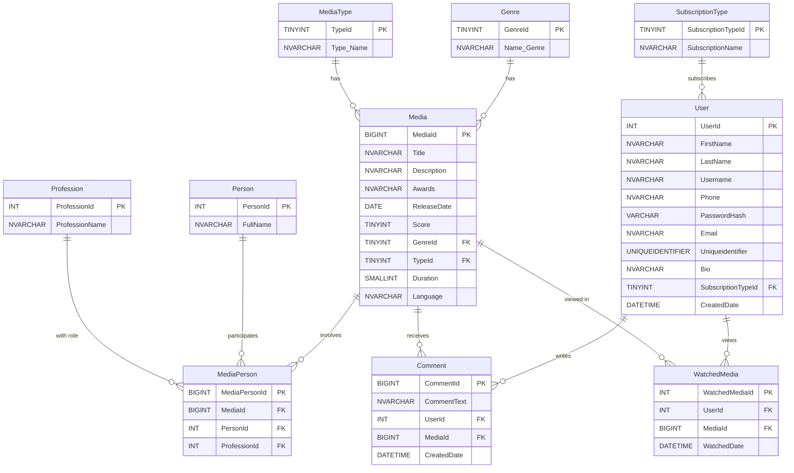

# 📌 Media Database – CS50 SQL Final Project

---

## 🎯 Purpose  

This project implements a normalized and scalable SQL database for managing multimedia content such as movies, series, anime, and documentaries. It also tracks user interactions including comments, views, and subscription types. The system serves as the backend for a media streaming platform, content analytics dashboard, or recommendation engine.

---

## 🧭 Scope  

The database supports:

- Categorization of media by genre and type  
- Contributor management (directors, actors, writers, etc.)  
- User profiles and subscription tracking  
- User-generated content (comments)  
- View tracking for analytics  
- Queries for business insights (e.g., most watched media, popular genres)

---

## 🧱 Entities and Relationships  

### Main Tables:

| Table Name         | Description                               |
| ------------------ | ----------------------------------------- |
| `Genre`            | Stores media genres                       |
| `MediaType`        | Stores media types (e.g., Series, Anime)  |
| `Media`            | Core media content                        |
| `Person`           | People involved in media                  |
| `Profession`       | Roles of people (e.g., Director, Actor)   |
| `MediaPerson`      | Links people to media with specific roles |
| `SubscriptionType` | Subscription types                        |
| `User`             | Platform users                            |
| `Comment`          | User comments on media                    |
| `WatchedMedia`     | Tracks which media users have watched     |

### Relationships:

- Each media has one genre and one type  
- Each person can be linked to multiple media with a profession  
- Each user can have one subscription type  
- Users can comment on and view multiple media  
- Deletion rules maintain referential integrity (e.g., cascade on comments)

---

## ⚙️ Design Decisions  

- **Normalization:** All tables are normalized to reduce redundancy  
- **Sparse Columns:** Used for optional fields to optimize storage  
- **Foreign Keys with ON DELETE:** Ensures data consistency  
- **Identity Columns:** Used for auto-incrementing primary keys  
- **Uniqueidentifier in Users:** Adds uniqueness for external integrations  
- **Check Constraints:** Ensure data validity (e.g., score between 1–10)

---

## 📈 Optimizations  

- **Indexes:** Created on foreign keys and frequently searched columns  
- **Sparse Columns:** Reduce storage for nullable fields  
- **Modular Schema:** Easy to extend with new media types or features  
- **Analytical Queries:** Designed for reporting and insights  

---

## 📄 Sample Queries Overview  

The database supports analytical queries including:

- Media not watched by any user  
- Media watched more than once  
- Top 3 most watched media  
- Most popular genre  
- Activate inactive subscriptions  
- Delete media by genre  
- Retrieve comments by user  
- Count media by genre  
- Find media by specific director  
- List users with premium subscriptions  

These queries demonstrate the database's analytical power and real-world usability.

---

## 🧬 Entity Relationship Diagram (ERD)  



---

## 🎥 Video Overview  

A short video has been recorded and uploaded to YouTube, showcasing:

- Project overview and schema  
- ERD walkthrough  
- Sample queries and results  
- Author and project metadata  

🔗 [Watch the video here](https://youtu.be/4rvoOxoRXBA?feature=shared)

---

## 📋 Implementation Notes

The database schema has been optimized for:

1. **Performance:** Indexes on foreign keys and frequently queried columns  
2. **Scalability:** Normalized structure with minimal redundancy  
3. **Flexibility:** Sparse columns for optional fields  
4. **Data Integrity:** Foreign key constraints with appropriate delete actions  
5. **Analytics:** Support for complex queries on user behavior and content popularity

---

## 🚀 Setup & Usage

### 📦 Requirements

- SQL Server (e.g., Microsoft SQL Server or Azure SQL)  
- SQL Server Management Studio (SSMS) or any SQL client  
- Basic familiarity with running SQL scripts

### ⚙️ Installation Steps

1. **Clone the repository**
   ```bash
   git clone https://github.com/sorna-fast/media-database-cs50sql.git
   cd media-database-cs50sql
   ```

2. **Open SQL Server Management Studio (SSMS)**  
   Or use any SQL client connected to your local or cloud SQL Server.

3. **Run the schema**
   - Open `schema.sql`
   - Execute the script to create the database and all tables

4. **Insert sample data**
   - Open `queries.sql`
   - Run the `INSERT` statements to populate the database with sample genres, media, users, and relationships

5. **Test queries**
   - Run the `SELECT`, `UPDATE`, and `DELETE` queries to explore the database functionality
---
## 👤 Author Information  
- **Name:** Masoud Ghasemi  
- **GitHub:** [sorna-fast](https://github.com/sorna-fast)  
- **email:** masudpythongit@gmail.com  
- **Telegram:** https://t.me/Masoud_Ghasemi_sorna_fast

---
---
---

# 📌 مستندات پروژه پایگاه داده رسانه‌ای – پروژه نهایی CS50 SQL


## 🎯 هدف پروژه  

این پروژه یک پایگاه داده SQL نرمال‌سازی‌شده و مقیاس‌پذیر برای مدیریت محتوای چندرسانه‌ای مانند فیلم‌ها، سریال‌ها، انیمه‌ها و مستندهاست. همچنین تعاملات کاربران مانند نظرات، بازدیدها و نوع اشتراک آن‌ها را ثبت می‌کند. این سیستم می‌تواند به‌عنوان بک‌اند یک پلتفرم پخش رسانه، داشبورد تحلیلی یا موتور پیشنهاددهنده عمل کند.

---

## 🧭 دامنه پروژه  

پایگاه داده از موارد زیر پشتیبانی می‌کند:

- دسته‌بندی رسانه‌ها بر اساس ژانر و نوع  
- مدیریت عوامل تولید (کارگردان، بازیگر، نویسنده و ...)  
- پروفایل کاربران و نوع اشتراک آن‌ها  
- ثبت نظرات کاربران  
- ردیابی بازدیدهای کاربران  
- اجرای کوئری‌های تحلیلی برای گزارش‌گیری و بینش‌های آماری

---

## 🧱 موجودیت‌ها و روابط  

### جداول اصلی:

| نام جدول           | توضیحات                                 |
| ------------------ | --------------------------------------- |
| `Genre`            | ذخیره ژانرهای رسانه                     |
| `MediaType`        | ذخیره انواع رسانه (مثلاً سریال، انیمه)   |
| `Media`            | اطلاعات اصلی رسانه                      |
| `Person`           | افراد دخیل در تولید رسانه               |
| `Profession`       | نقش‌های افراد (مثلاً کارگردان، بازیگر)    |
| `MediaPerson`      | ارتباط افراد با رسانه و نقش آن‌ها        |
| `SubscriptionType` | انواع اشتراک کاربران                    |
| `User`             | اطلاعات کاربران                         |
| `Comment`          | نظرات کاربران روی رسانه                 |
| `WatchedMedia`     | رسانه‌هایی که توسط کاربران مشاهده شده‌اند |

### روابط:

- هر رسانه دارای یک ژانر و یک نوع است  
- هر فرد می‌تواند در چند رسانه با نقش خاصی حضور داشته باشد  
- هر کاربر دارای یک نوع اشتراک است  
- کاربران می‌توانند روی چند رسانه نظر بدهند و آن‌ها را مشاهده کنند  
- قوانین حذف برای حفظ یکپارچگی داده‌ها تنظیم شده‌اند

---

## ⚙️ تصمیمات طراحی  

- **نرمال‌سازی:** تمام جداول نرمال‌سازی شده‌اند تا از تکرار داده جلوگیری شود  
- **ستون‌های پراکنده:** برای فیلدهای اختیاری جهت بهینه‌سازی فضای ذخیره‌سازی  
- **کلیدهای خارجی با ON DELETE:** برای حفظ انسجام داده‌ها  
- **کلیدهای اصلی خودافزاینده:** برای ساده‌سازی درج داده‌ها  
- **شناسه یکتا در کاربران:** برای یکپارچگی بیشتر و امکان اتصال به سیستم‌های خارجی  
- **محدودیت‌های بررسی:** برای اعتبارسنجی داده‌ها (مثلاً امتیاز بین ۱ تا ۱۰)

---

## 📈 بهینه‌سازی‌ها  

- **ایندکس‌ها:** روی کلیدهای خارجی و ستون‌های پرتکرار ایجاد شده‌اند  
- **ستون‌های پراکنده:** فضای ذخیره‌سازی را برای فیلدهای اختیاری کاهش می‌دهند  
- **ساختار ماژولار:** امکان توسعه آسان با افزودن نوع رسانه یا ویژگی‌های جدید  
- **کوئری‌های تحلیلی:** برای گزارش‌گیری و بینش‌های آماری طراحی شده‌اند

---

## 📄 مرور کوئری‌های نمونه  

پایگاه داده از کوئری‌های تحلیلی زیر پشتیبانی می‌کند:

- رسانه‌هایی که هیچ کاربری مشاهده نکرده  
- رسانه‌هایی که بیش از یک‌بار مشاهده شده‌اند  
- سه رسانه پربازدید  
- محبوب‌ترین ژانر  
- فعال‌سازی اشتراک‌های غیرفعال  
- حذف رسانه‌های ژانر کمدی  
- دریافت نظرات یک کاربر خاص  
- شمارش رسانه‌ها بر اساس ژانر  
- یافتن رسانه‌های ساخته‌شده توسط یک کارگردان خاص  
- کاربران دارای اشتراک پریمیوم  

این کوئری‌ها قدرت تحلیلی و کاربرد واقعی پایگاه داده را نشان می‌دهند.

---

## 🧬 نمودار موجودیت-رابطه (ERD)  


---

## 🎥 معرفی ویدیویی پروژه  

یک ویدیوی کوتاه ضبط شده و در YouTube آپلود شده که شامل موارد زیر است:

- معرفی کلی پروژه و ساختار پایگاه داده  
- بررسی نمودار ERD  
- اجرای نمونه کوئری‌ها و نمایش نتایج  
- اطلاعات نویسنده و متادیتای پروژه  

🔗 [مشاهده ویدیو](https://youtu.be/4rvoOxoRXBA?feature=shared)

---

## 📋 نکات اجرایی و پیاده‌سازی

ساختار پایگاه داده برای موارد زیر بهینه‌سازی شده است:

1. **عملکرد:** ایندکس روی کلیدهای خارجی و ستون‌های پرتکرار  
2. **مقیاس‌پذیری:** ساختار نرمال‌سازی‌شده با حداقل افزونگی  
3. **انعطاف‌پذیری:** ستون‌های پراکنده برای فیلدهای اختیاری  
4. **یکپارچگی داده:** کلیدهای خارجی با رفتارهای حذف مناسب  
5. **تحلیل‌پذیری:** پشتیبانی از کوئری‌های پیچیده برای رفتار کاربران و محبوبیت محتوا

---

## 🚀 نصب و اجرا

### 📦 پیش‌نیازها

- SQL Server (مثلاً Microsoft SQL Server یا Azure SQL)  
- نرم‌افزار SQL Server Management Studio (SSMS) یا هر کلاینت SQL دیگر  
- آشنایی اولیه با اجرای اسکریپت‌های SQL

### ⚙️ مراحل نصب

1. **کلون کردن ریپازیتوری**
   ```bash
   git clone https://github.com/sorna-fast/media-database-cs50sql.git
   cd media-database-cs50sql
   ```

2. **باز کردن SSMS یا کلاینت SQL**  
   به دیتابیس محلی یا ابری خود متصل شوید.

3. **اجرای فایل schema.sql**  
   - فایل `schema.sql` را باز کنید  
   - اسکریپت را اجرا کنید تا دیتابیس و جدول‌ها ساخته شوند

4. **درج داده‌های نمونه**  
   - فایل `queries.sql` را باز کنید  
   - دستورات `INSERT` را اجرا کنید تا داده‌های نمونه وارد شوند

5. **اجرای کوئری‌ها**  
   - دستورات `SELECT`, `UPDATE`, و `DELETE` را اجرا کنید تا عملکرد پایگاه داده را بررسی کنید

---

## 👤 اطلاعات نویسنده 
- **نام:** مسعود قاسمی  
- **گیت‌هاب:** [sorna-fast](https://github.com/sorna-fast)
- **ایمیل:** masudpythongit@gmail.com

---
